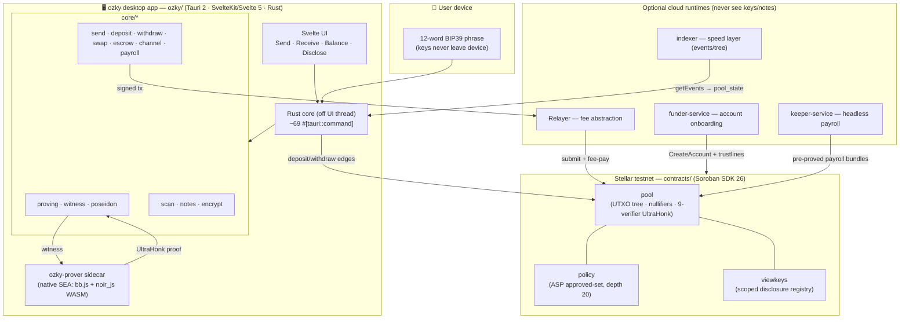
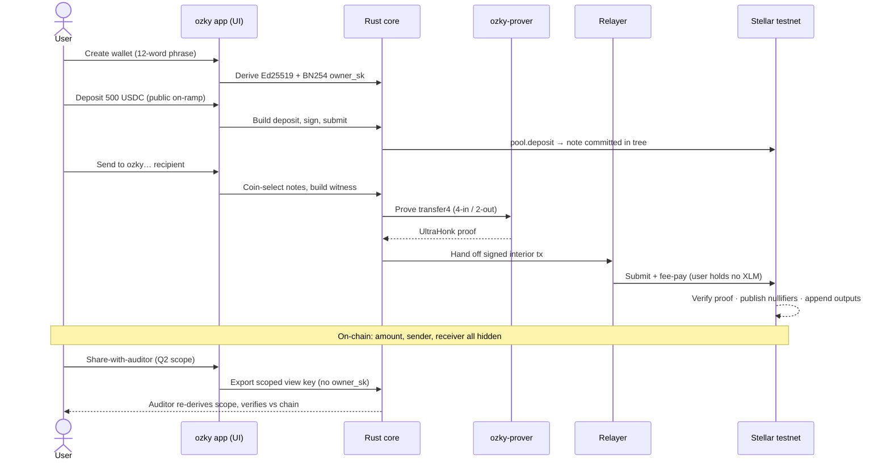

<div align="center">


### **Fully shielded stablecoin payments on Stellar — private by default, audit when you choose**

<br>

[](./LICENSE)
[](https://stellar.expert/explorer/testnet)
[](#deployed-contracts-stellar-testnet)
[](#circuits)
[](#repository-layout)
[](#repository-layout)

<br>

**[Background](#the-background)** · **[What it does](#what-it-does)** · **[Architecture](#architecture)** · **[User Flow](#user-flow)** · **[Contracts](#deployed-contracts-stellar-testnet)** · **[Circuits](#circuits)** · **[Where it lives](#where-it-lives)** · **[Develop](#continuing-development)** · **[License](#license)**

<br><br><br>
</div>

**OZKY** is a native desktop wallet for **fully shielded stablecoin payments on Stellar/Soroban**. Privacy is the default: the amount, the sender, and the receiver are **hidden on-chain**. Balances aren't account entries — they're private notes in a **UTXO shielded pool**, and spending one proves Merkle membership in zero-knowledge and publishes a nullifier. 

Heavy cryptography — proving, note scanning, encryption — runs in a **native Rust core off the UI thread**, so the Svelte UI only ever exposes plain actions: Send, Receive, Balance, Share-with-auditor.

Built on **Noir / UltraHonk** client-side proofs verified by **Soroban** contracts using Stellar's BN254 and Poseidon host functions. Running live on **Stellar testnet**.

> ### ⚠️ Testnet · unaudited
> ozky targets **test networks only** and has **not been independently audited**. Do not use it to secure assets of real value. Mainnet support is gated on a security audit. Your 12-word recovery phrase and all keys live **only on your device** — there is no custody, no reset, and no recovery backdoor.

> A full clone with every subproject's `node_modules` and the Rust/Contracts/GKE build artifacts is roughly **33 GB**. Clone at your risk, install per-subproject (not all at once)

---

## The Background

Every stablecoin payment you make today is public forever. Send USDC to a contractor, a supplier, or an employee and the amount, both parties, and the timing are written to a ledger anyone can read and correlate for the rest of time. "It's just an address" is not privacy — addresses are trivially clustered, and once one payment is linked to you, your whole balance and counterparty graph leaks with it. For payroll, treasury, and ordinary commerce that transparency isn't a feature, it's a liability.

The usual answers are bad trades. Centralized mixers ask you to hand custody to a black box. Most "private" chains make you leave the asset and the ecosystem you actually use. And almost none of them give you a way to *selectively* prove what you did when an auditor, a counterparty, or the law needs it — privacy and accountability are treated as opposites.

**ozky makes privacy the default and disclosure a choice you control.**

1. **Shielded by default — the foundation.** Notes are **Poseidon commitments** in an append-only Merkle tree (depth 20). Spending proves membership and publishes a **nullifier** (`Poseidon(rho, owner_sk)`) so double-spends are rejected, while amount, sender, and receiver stay hidden. Proofs are generated **client-side** in the Rust core and verified on-chain by a Soroban UltraHonk verifier. *This is what makes a public ledger private without leaving Stellar.*

2. **Real money flows — the rail.** Public on-ramp (`deposit`), private transfer to an `ozky…` code (`send`), and public off-ramp (`withdraw`, with the destination **bound in-circuit** so it can't be redirected). On top of that: multi-input transfers, consolidate/split, an **in-pool shielded AMM** swap, hidden-sum **escrow**, merchant-pull **payment channels**, and a scheduler for **payroll & subscriptions** — all in one atomic shielded model, no public DEX edge.

3. **Selective disclosure — accountability without surveillance.** Scoped, revocable **BIP32-style view keys** (a viewing secret + `owner_pk`, never the spending key) let you hand an auditor exactly one slice of your history, each note re-verified against chain. An in-circuit **ASP approved-set membership** check (`owner_pk ∈ asp_root`) keeps shielded funds provably part of a clean set. You disclose what you choose, to whom you choose, and can revoke it.

The thing a public payment can never be — *private by default, yet provable on demand* — is exactly what ozky makes every transfer.

---

## What it does

You install a desktop app, create a wallet from a 12-word phrase, and move stablecoins privately:

> *"Pay this contractor 500 USDC, run payroll for the team every two weeks, and let my accountant see only the Q2 invoices."*

- A **deposit** shields public USDC/EURC/XLM into the pool as a private note.
- A **send** transfers value to an `ozky…` recipient code — the on-chain transaction reveals nothing about who, whom, or how much.
- A **withdraw** unshields back to a public `G…` address, with `dest_bind` enforced on-chain so the off-ramp can't be rerouted.
- **transfer4** spends up to 4 owned notes at once; **consolidate/split** reshapes your note set.
- **Shielded swap** trades assets through an in-pool constant-product AMM (`x·y=k`) in one atomic, edge-free transaction.
- **Escrow** (hidden-sum, Pedersen-over-Grumpkin) and **payment channels** (merchant-pull, Schnorr-over-Grumpkin offline draws) cover group pay and subscriptions.
- The **scheduler** runs payroll and push subscriptions — locally while the app is open, or headless via the **keeper** service.
- **Share-with-auditor** exports a scoped, read-only view key; the auditor re-derives exactly that scope and verifies every note against chain.

The 12-word phrase derives **two separate keys**: an Ed25519 Stellar key for public transactions and a **BN254-native `owner_sk`** used only in-circuit — the Stellar key is never reused inside a proof.

---

## Architecture



## User Flow



---

## Deployed contracts (Stellar testnet)

Three Soroban contracts are deployed and wired on Stellar testnet. The UltraHonk proof verifier is **embedded per-circuit inside the pool** (a "9-verifier pool"), with immutable verifying keys — it is not a separate contract. Assets registered on the live pool: **XLM** (`asset_tag 1`), **USDC** (`2`, live on Circle testnet USDC), **EURC** (`4`); **USDT** (`3`) is defined but not yet live.

| Contract | Address (→ Stellar Expert) | What it does |
|---|---|---|
| `pool` | [`CCCULLPY…XUOF`](https://stellar.expert/explorer/testnet/contract/CCCULLPYVOFZF5WWVJNSF2HGBY3SMZWO25BPEOBXWMYM3VRM6YVVXUOF) | UTXO shielded pool: append-only Merkle tree (depth 20), nullifier set, asset vaults, and the 9-circuit UltraHonk verifier. Entrypoints for deposit/withdraw/transfer/split/swap/escrow/channel. |
| `policy` | [`CCXRKEM3…G2CP`](https://stellar.expert/explorer/testnet/contract/CCXRKEM3MUJBFXJOC6VMU7OUFJWSNO76LJPSTSQIODSSLZ2AMNTZG2CP) | ASP compliance layer: maintains the depth-20 Poseidon approved set on-chain; spends prove `owner_pk ∈ asp_root`. |
| `viewkeys` | [`CDTYQIHS…MBSV`](https://stellar.expert/explorer/testnet/contract/CDTYQIHSCRUPNGI42SLXMHHXXWMX4DQTBYMHBEXUALZ7GVZWXRI3MBSV) | Scoped, revocable view-key registry for selective disclosure. |

Key parameters: Merkle tree **depth 20** · note commitment = Poseidon of the note fields · nullifier = `Poseidon(rho, owner_sk)` · proving system **Noir / UltraHonk (BN254)** · in-circuit owner key is BN254-native, **never** the Ed25519 Stellar key.

**Proven live on testnet:** shielded send · multi-note `transfer4` (13-PI proof, tx `3abd7f1a…`) + consolidate (`a9fc687b…`) · in-pool AMM swap (5 XLM→USDC, 14-PI proof, tx `eaf43c18…`, conservation exact) · merchant-pull channel close (`5217caa5…`) + reclaim (`5ffdc90f…`) · scoped auditor disclosure re-verified against chain.

---

## Circuits

Every shielded action is a **Noir / UltraHonk** circuit proved **client-side** in the Rust core and verified on-chain by the pool's embedded per-circuit verifier (the "9-verifier pool"). Verifying keys are frozen and immutable. Circuits are **entrypoints of the pool, not separate contracts** — there is no standalone verifier contract. Each operates over the depth-20 Merkle tree, proves membership of the notes it spends, and publishes a nullifier per spent note.

| Circuit | Shape | What it proves |
|---|---|---|
| `deposit` | public → 1 note | Shields public funds into a fresh note; commitment well-formed, value matches the public on-ramp amount. |
| `transfer` / `transfer4` | up to 4-in / 2-out | Private transfer: spends owned notes, conserves value, emits recipient + change notes. `transfer4` enables multi-input sends and **consolidate**. |
| `withdraw` | 1 note → public | Unshields to a public `G…` address with `dest_bind` enforced in-circuit, so the off-ramp destination can't be redirected. |
| `split` | 1-in / N-out (padded 6) | Splits one note into several owned notes for denomination management and pay-many. |
| `notes` | — | Shared note-format library: commitment and nullifier derivation used by the other circuits. |
| `shielded_swap` | burn A / mint B | In-pool constant-product AMM (`x·y=k`): burns a note of asset A, mints a note of asset B proving value against reserves. One atomic tx, no public DEX edge; 14 public inputs. |
| `escrow_contribute` / `escrow_payout` | hidden-sum | Hidden-sum escrow over Pedersen-over-Grumpkin commitments: contributors add to a hidden total, payout proves the sum without revealing per-party amounts. |
| `channel_close` | merchant-pull | Settles a one-way payment channel; an in-circuit Schnorr-over-Grumpkin signature authorizes the offline draw (open → close / expiry → reclaim). |

Compliance and disclosure ride alongside the spend proofs: every transfer additionally proves **ASP approved-set membership** (`owner_pk ∈ asp_root`, depth 20) against the `policy` contract, while scoped view keys carry the viewing secret + `owner_pk` only — **never** `owner_sk`.

---

## Where it lives

Each row points at the file that implements the capability.

### Shielded core & proving

| Capability | Code |
|---|---|
| **Client-side proving** vs frozen VKs (UltraHonk) | [`ozky/src-tauri/src/core/proving.rs`](https://github.com/xavio2495/ozky/blob/main/ozky/src-tauri/src/core/proving.rs) |
| **Stateful witness generator** (circuit-matching) | [`ozky/src-tauri/src/core/witness.rs`](https://github.com/xavio2495/ozky/blob/main/ozky/src-tauri/src/core/witness.rs) |
| **Native Poseidon2** (matches the circuit hash) | [`ozky/src-tauri/src/core/poseidon.rs`](https://github.com/xavio2495/ozky/blob/main/ozky/src-tauri/src/core/poseidon.rs) |
| **Note encryption + view-tag scanning** (X25519→HKDF→AEAD) | [`ozky/src-tauri/src/core/encrypt.rs`](https://github.com/xavio2495/ozky/blob/main/ozky/src-tauri/src/core/encrypt.rs) · [`scan.rs`](https://github.com/xavio2495/ozky/blob/main/ozky/src-tauri/src/core/scan.rs) |
| **Docker-free prover sidecar** (SEA: bb.js + noir_js WASM) | [`prover-sidecar/prove.mjs`](https://github.com/xavio2495/ozky/blob/main/prover-sidecar/prove.mjs) |

### Money flows

| Capability | Code |
|---|---|
| **deposit / send / withdraw** (`dest_bind` enforced on-chain) | [`core/deposit.rs`](https://github.com/xavio2495/ozky/blob/main/ozky/src-tauri/src/core/deposit.rs) · [`send.rs`](https://github.com/xavio2495/ozky/blob/main/ozky/src-tauri/src/core/send.rs) · [`withdraw.rs`](https://github.com/xavio2495/ozky/blob/main/ozky/src-tauri/src/core/withdraw.rs) |
| **In-pool shielded AMM swap** (`x·y=k`, atomic, no public edge) | [`core/swap.rs`](https://github.com/xavio2495/ozky/blob/main/ozky/src-tauri/src/core/swap.rs) |
| **Hidden-sum escrow** (Pedersen-over-Grumpkin) | [`core/escrow.rs`](https://github.com/xavio2495/ozky/blob/main/ozky/src-tauri/src/core/escrow.rs) · [`pedersen.rs`](https://github.com/xavio2495/ozky/blob/main/ozky/src-tauri/src/core/pedersen.rs) |
| **Merchant-pull payment channels** (Schnorr-over-Grumpkin draws) | [`core/channel.rs`](https://github.com/xavio2495/ozky/blob/main/ozky/src-tauri/src/core/channel.rs) |
| **Payroll & push subscriptions** scheduler | [`core/payroll.rs`](https://github.com/xavio2495/ozky/blob/main/ozky/src-tauri/src/core/payroll.rs) · [`subscriptions.rs`](https://github.com/xavio2495/ozky/blob/main/ozky/src-tauri/src/core/subscriptions.rs) |

### Keys, disclosure & compliance

| Capability | Code |
|---|---|
| **Key hierarchy** (Ed25519 + distinct BN254 `owner_sk` + view keys) | [`core/keys.rs`](https://github.com/xavio2495/ozky/blob/main/ozky/src-tauri/src/core/keys.rs) · [`keychain.rs`](https://github.com/xavio2495/ozky/blob/main/ozky/src-tauri/src/core/keychain.rs) |
| **Scoped, revocable view-key disclosure** | [`core/disclose.rs`](https://github.com/xavio2495/ozky/blob/main/ozky/src-tauri/src/core/disclose.rs) |
| **ASP approved-set enrollment** (`owner_pk ∈ asp_root`) | [`core/enroll.rs`](https://github.com/xavio2495/ozky/blob/main/ozky/src-tauri/src/core/enroll.rs) |
| **Raw-RPC chain client → `pool_state`** | [`core/chain.rs`](https://github.com/xavio2495/ozky/blob/main/ozky/src-tauri/src/core/chain.rs) |

### Circuits

Noir / UltraHonk circuits under [`circuits/`](https://github.com/xavio2495/ozky/tree/main/circuits) — each is a verified **entrypoint of the pool**, not a separate contract: `deposit`, `transfer` / `transfer4` (4-in/2-out), `withdraw`, `split` (1-in/N-out, padded 6), `notes`, `shielded_swap`, `escrow_contribute` / `escrow_payout`, `channel_close`.

### Cloud runtimes (optional — never receive keys or note plaintext)

| Runtime | Code |
|---|---|
| **Relayer** — pre-funded fee abstraction (user holds no XLM) | [`core/funder.rs`](https://github.com/xavio2495/ozky/blob/main/ozky/src-tauri/src/core/funder.rs) |
| **funder-service** — account onboarding (CreateAccount + trustlines) | [`funder-service/`](https://github.com/xavio2495/ozky/tree/main/funder-service) |
| **keeper-service** — headless payroll (pushes pre-proved bundles) | [`keeper-service/`](https://github.com/xavio2495/ozky/tree/main/keeper-service) |
| **indexer** — speed layer (events/accumulator/tree; funds recover from chain alone) | [`indexer/`](https://github.com/xavio2495/ozky/tree/main/indexer) |

---

## Repository layout

```
ozky/             Tauri 2 + SvelteKit/Svelte 5 + Rust desktop wallet (the product)
                  src-tauri/src/core/*  — the Rust shielded engine (~69 tauri commands)
web/              SvelteKit + Tailwind marketing site (Vercel) — separate app, shares no code
contracts/        Soroban workspace (soroban-sdk 26): pool · policy · viewkeys · rs-soroban-ultrahonk
circuits/         Noir / UltraHonk circuits: deposit · transfer4 · withdraw · split · swap · escrow · channel
prover-sidecar/   Native ozky-prover (SEA: bb.js + noir_js WASM) — Docker-free client proving
keeper-service/   Headless payroll keeper (Cloud Run)
funder-service/   Account onboarding / funder (CreateAccount + trustlines)
indexer/          Event/tree speed-layer indexer (Cloud Run)
claude-docs/      Project brief & frozen spec (build_plan · handoff · docs)
```

The ZK toolchain (Noir/Barretenberg) has no native Windows build and runs in Docker; the wallet and web app build natively. See `CLAUDE.md` for the dev-container details.

---

## Continuing development

> **ZK toolchain in Docker:** Noir/Barretenberg run in the `compose.zk.yaml` dev container (Rust 1.96, Stellar CLI 26.1, `nargo 1.0.0-beta.22`, `bb 5.0.0`). Use `bash -c`, not `bash -lc` (login shells drop the cargo PATH), and do multi-step on-chain flows in **one** `run --rm` (each run is a fresh container; only `/workspace` and the cargo volume persist).

**Prerequisites:** Node 20+, the Rust toolchain (for Tauri), Docker (for contracts/circuits). Secrets (relayer seed, deployed addresses) live in `ozky.config.json`, which is gitignored — **never commit it**, and never publish the `OZKY_RELAYER_SECRET`.

```bash
# 1. Desktop wallet (primary dev loop) — Vite on :1420, then the Tauri shell
cd ozky && npm install && npm run tauri dev
npm run check                     # svelte-kit sync + svelte-check (the static gate)

# 2. Marketing site — Vite dev server
cd web && npm install && npm run dev
npm run check && npm run lint     # static gates

# 3. Contracts (in the ZK container)
docker compose -f compose.zk.yaml build
docker compose -f compose.zk.yaml run --rm zk bash -c 'cd contracts && cargo test'
docker compose -f compose.zk.yaml run --rm zk bash -c 'cd contracts && stellar contract build'

# 4. Circuits (in the ZK container) — proof flow order: write_vk → prove -k <vk> → verify
docker compose -f compose.zk.yaml run --rm zk bash -c 'cd circuits/transfer4 && nargo compile && nargo execute witness'
```

**Adding a Tauri command** requires three edits or the call is rejected at runtime: a `#[tauri::command]` in `ozky/src-tauri/src/core/*` (or `commands.rs`), registration in `generate_handler!` in `ozky/src-tauri/src/lib.rs`, and — if it touches the OS — a capability grant in `ozky/src-tauri/capabilities/default.json`.

**Frontend constraints:** the wallet UI is SvelteKit in **SPA mode** (`adapter-static`, `ssr = false` globally). There is no Node server — don't add SSR-only code or `+page.server.ts` load logic that needs a backend. Dev ports are fixed (1420 / HMR 1421) with `strictPort` on.

**Deploying the marketing site:** `web/` deploys to Vercel with **Root Directory `web`**. The Vercel adapter fails locally on Windows with `EPERM ... symlink` (needs Developer Mode or an elevated shell); Vercel builds on Linux. For routine checks, rely on `npm run check`.

---

## License

Licensed under the **GNU General Public License v3.0** (GPL-3.0). See [`LICENSE`](./LICENSE) for the full text.

> **Testnet · unaudited:** the software is provided "as is", without warranty of any kind (GPL-3.0 §§15–16). ozky has not been independently audited; an audit is a hard gate before any mainnet use.

---

<br><br><br>

<div align="center">

<h3>Built By

[Immanuel](https://github.com/xavio2495)

</h3>
</div>
